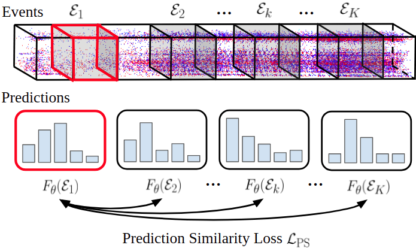

# Ev-TTA: Test-Time Adaptation for Event-Based Object Recognition
Official PyTorch implementation of **Ev-TTA: Test-Time Adaptation for Event-Based Object Recognition (CVPR 2022)**
[[Paper]](https://arxiv.org/abs/2203.12247)

[](evtta.png)

In this repository, we provide instructions for running Ev-TTA on the N-ImageNet dataset.
If you have any questions regarding the codebase, please leave an issue or contact 82magnolia@snu.ac.kr.

## Preparation
Follow instructions in the N-ImageNet repository [[Link]](https://github.com/82magnolia/n_imagenet) to download the N-ImageNet dataset and pretrained models.
As this codebase only uses pre-trained models, only the N-ImageNet variants need to be downloaded.

### Dataset
Once you download the N-ImageNet variants, create a `Datasets/` directory within `real_cnn_model`, and create a symbolic link to the downloaded dataset within `Datasets`.
To illustrate, suppose the N-ImageNet variants are downloaded in `/home/user/assets/Datasets/N_Imagenet/`.
Then, to create symbolic links use the following command.
```
cd PATH_TO_REPOSITORY/real_cnn_model
mkdir Datasets; cd Datasets
ln -sf /home/user/assets/Datasets/N_Imagenet_cam/ ./
```
Congratulations! Now you can start running Ev-TTA.

### Pretrained Models
This repository provides test-time adaptation implementations for the following event representations: DiST, Binary Event Image, Event Image, Timestamp Image, Event Histogram, and Sorted Time Surface.
Note that the naming of event representations used in the codebase is different from that of the original paper. 
Please use the following table to convert event representations used in the paper to event representations used in the codebase.

| Paper               | Codebase                   |
|---------------------|----------------------------|
| DiST                | reshape_then_acc_adj_sort  |
| Binary Event Image  | reshape_then_acc_flat_pol  |
| Event Image         | reshape_then_acc           |
| Timestamp Image     | reshape_then_acc_time_pol  |
| Event Histogram     | reshape_then_acc_count_pol |
| Sorted Time Surface | reshape_then_acc_sort      |

### Installation
The codebase is tested on a Ubuntu 18.04 machine with CUDA 10.1. However, it may work with other configurations as well.
First, create and activate a conda environment with the following command.
```
conda env create -f environment.yml
conda activate e2t
```
In addition, you must install pytorch_scatter. Follow the instructions provided in the [pytorch_scatter github repo](https://github.com/rusty1s/pytorch_scatter). You need to install the version for torch 1.7.1 and CUDA 10.1.

## Running Ev-TTA
To run Ev-TTA on all tested event representations, run the following command.
```
cd real_cnn_model/scripts
./run_ev_tta_all.sh
```

To run Ev-TTA on a single event representation, run the following command (this is for running on the Timestamp Image).
```
cd real_cnn_model/scripts
./run_ev_tta.sh reshape_then_acc_time_pol ./experiments/pretrained/2_time_surface/best.tar
```

## Citation
If you find the dataset or codebase useful, please cite

```
@InProceedings{Kim_2022_CVPR,
    author    = {Kim, Junho and Hwang, Inwoo and Kim, Young Min},
    title     = {Ev-TTA: Test-Time Adaptation for Event-Based Object Recognition},
    booktitle = {Proceedings of the IEEE/CVF Conference on Computer Vision and Pattern Recognition (CVPR)},
    month     = {June},
    year      = {2022},
    pages     = {17745-17754}
}
```
